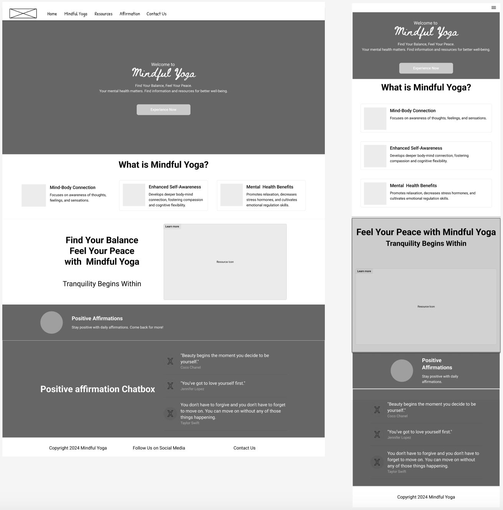

#  Welcome to my Mindful Yoga Project

<a href="https://waiyiwong.github.io/mindful_yoga/" target="_blank" style="text-align: center;">Click here to view my first website project at Code Institute - LIVE site here</a>  
(To open in a new tab/ window, press "ctrl" (or ⌘ for Mac) + click on the link) 

---
## CONTENTS  
* [About the site](#about-mindful-yoga)
  * [Primary Goal](#primary-goal)
  * [Target Audience](#target-audience)
  * [Scope / Key Features](#scope--key-features)
* [UX (User Experience) Desgin](#user-experience)
  * [Visitor Goals](#visitor-goals) 
  *[User-Centered Design Elements](#user-centered-design-elements)
* [Design](#design)
  * [Wireframes](#wireframes)
  * [Colour Scheme](#color-scheme)
  * [Typography](#typography)
  * [Imagery](#imagery)
* [Page Features](#page-features)
  * [Navbar](#navbar)
  * [Hero-Image](#hero-image)
  * [Tagline & Call to Action](#tagline--call-to-action)
  * [Business Ethos](#business-ethos)
  * [Menu Page](#menu-page)
  * [Contact Page](#contact-page)
  * [Footer](#footer)  
* [Tablet & Mobile View](#tablet--mobile-view)
  * [Desktop, Tablet & Mobile Differences](#desktop-tablet--mobile-differences)
  * [Tablet View](#tablet-view)
  * [Mobile View](#mobile-view)
* [Future Features](#future-features)
* [Technologies Used](#technologies-used)
  * [Languages Used](#languages-used)
  * [Frameworks, Libraries, Technologies & Programs Used](#frameworks-libraries-technologies--programs-used)
* [Deployment](#deployment)
  * [How to deploy](#how-to-deploy)
* [Testing](#testing)
  * [HTML Validation using W3C Validation](#html-validation-using-w3c-validation)
  * [CSS Validation using W3C Validation](#css-validation-using-w3c-validation)
  * [Lighthouse scores via Chrome Developer Tools](#lighthouse-scores-via-chrome-developer-tools)
  * [Bugs & Fixes](#bugs--fixes)
  * [Unsolved Bugs](#unsolved-bugs)
* [Credits](#credits) 

---    

## About Mindful Yoga
### **Primary Goal**  
Mindful Yoga website is designed to provide a calming, intuitive, and supportive user experience that aligns with our goal of promoting mental wellbeing through mindful yoga practices.

### **Target Audience**
Our target audience primarily consists of women aged 25-45 who are seeking inner peace, self-acceptance, and improved relationships with themselves and others. These individuals, ranging from beginners to intermediate yoga practitioners, are often busy professionals or mothers looking for accessible mindful yoga solutions to relieve stress and enhance their physical and mental well-being. They are tech-savvy and comfortable using online platforms to access resources and guided sessions, making our digital offerings an ideal fit for their lifestyle. Our focus is on providing these women with the tools they need to cultivate flexibility, both in body and mind, through mindful yoga practices tailored to their unique needs and time constraints.

### **Scope / Key Features**
#### **Guided Mindful Yoga Video**
High-quality, professionally produced video content
Clear, easy-to-follow instructions suitable for all levels
Option to adjust video quality based on user's internet speed
#### **Resource Library**
Curated list of recommended books on mindfulness and yoga
Carefully selected digital resources for further learning
User-friendly categorization and search functionality
#### **Positive Affirmations**
Selected affirmations and quotes from celebrities and famous people for motivation.
#### **Interactive Affirmation Chatbot**
AI-powered chatbot for personalized affirmation conversations
Natural language processing for a more human-like interaction
Option to save chat history for future reference
#### **Contact Us**
Easy-to-find contact form with clear fields
Multiple contact options (email, phone, social media)
Quick response guarantee to enhance user trust

--- 
## **User Experience**
Mindful Yoga website is designed to provide a calming, intuitive, and supportive user experience that aligns with our goal of promoting mental well-being through mindful yoga practices.

### **Visitor Goals** 
For all first-time, returning, and frequent users, visitors can quickly and intuitively access content of the site with one click/touch via the navigation bar and fixed footer section.  

### **User-Centered Design Elements**
#### **Intuitive Navigation**
Clear, concise menu structure for easy site exploration
#### **Calming Visual Design**
Soothing nautral color palette to evoke tranquility
High-quality video of mindful yoga and serene environments
Consistent, clean typography enhancing readability
#### **Responsive Design**
Fully adaptive layout for various devices and screen sizes
Touch-friendly interface optimized for mobile users
#### **Accessibility Features**
High contrast mode for visually impaired users
Screen reader compatibility (aria-label included)
Keyboard navigation support
Auto-generated captions for video content
 

--- 
 ## **Design**
 ### **Wireframes**  
Wireframe - Homepage Desktop & Mobile

### **Color Scheme**  
This website used a natural palette of pinks and oranges that were inspired by the hero background image.  I combined these with a darker colour for contrast and readabilty in the text.
  

[Adobe Color](https://color.adobe.com/create/color-contrast-analyzer) checked how accessible the colours are.  

### **Typography**  
  
[Google Fonts](https://fonts.google.com/) was used to import the fonts 'Beth Ellen' and 'Roboton'. I used Beth Ellen for h1 headings and Roboton for the main content.

  
### **Imagery**   
Mindful Yoga use stock and AI images throughout the website, with attributions to the designers placed in the [Credits](#credits) section of this README doc.

---  

### **Navbar and Hero Page**   

Mindful Yoga 

### **Taglines **  

Mindful Yoga -- "Find Your Balance, Feel Your Peace." and "Tranquility Begins Wthin"

## Tablet & Mobile View  
 
### **Desktop, Tablet & Mobile Differences**  

To ensure responsivity I used Bootstrap 5.3.3. All elements resize and wrap as necessary, with everything appearing in a column for smaller screens. The header navbar changed to pull-down toggler hamburger icon for smaller screen devices.
  

---  

## Future Features  

- For future development, I would like to include more videos, information, and build a community on Mindful Yoga.

## Technologies Used    

### **Languages Used**   

- HTML5
- CSS3

### **Frameworks, Libraries, Technologies & Programs Used**  

- GitHub - used to save and store all files for this website  
- Git - used for version control
- Google Fonts - fonts were imported from here 
- Figma - used to create wireframes and edit texts and images 
- FontAwesome - icons were imported from here
- Adobe Color - for all color palettes and accessibility contrast ratios  
- Adobe Express - to resize and edit images
- Freepik.com - for AI generated images generation
- Adobe Firefly - for additional AI generated images
- Realfavicongenerator.net - for favicon
- ChatGBT - for ideas and information
- Google Dev Tools - to debug and for testing responsiveness 
- Google Lighthouse - for auditing the website
- W3C Validator - for validating the HTML and CSS code

---   

## Deployment

### **How to deploy**  

GitHub was used to deploy the website. These were the steps taken to acheive this:  

1. Login to GitHub account
2. Navigate to the project repository, mindful_yoga
3. Click the Settings button near the top of the page
4. In the left-hand menu, find and click on the Pages button
5. In the Source section, choose 'main' from the drop-down, select branch menu
6. Select 'root' from the drop-down folder menu
7. Click 'Save' and after a few moments the project will have been made live and a link is visible at the top of the page

### **Initial testing plan**

I had planned for this site to be accessible and legible on all screen sizes. I used Chrome Dev Tools to test, tweak and debug in the early stages. I deployed my site halfway through to test on real-world devices. These devices included:  
- MacBook Pro
- MacBook Air
- iPad Pro
- iPhone 15 Pro
- Sony Xperia

### **Testing**    

Testing took place throughout the entire build using Dev Tools on Chrome and on the above real-world devices. The browsers used were:  
- Chrome   
- Safari  

### **HTML Validation using W3C Validation**  

Landing page HTML validation
  

   

Menu page HTML validation
  

  

Contact page HTML validation
  

  
  
   

### **CSS Validation using W3C Validation** 

CSS validation
  

   

   

## Credits  
  
### **Content References**
- Mindful Yoga is built entirly by myself from scratch with reference to the folllowing websites:
- [Code Institute](https://codeinstitute.net/ie/) for their HTML/CSS learning materials.
- [Bootstrap](https://getbootstrap.com/docs/5.3/) for additional learning material and help with bootstrap.
- [MDN Web Docs](https://developer.mozilla.org/en-US/docs/Learn/CSS/CSS_layout/Flexbox) for flexbox tutorials and guidance.

### **Media References**  
  
- Adobe Color - for all color palettes and accessibility contrast ratios  
- Adobe Express - to resize and edit images
- Adobe Firefly - for additional AI generated images
- Freepik.com - for AI generated images generation
- Realfavicongenerator.net - for favicon
- Figma - used to create wireframes and edit texts and images 

### **Acknowledgements** 
- I would like to acknowledge my Code Institute facilitator, Shelly, for her teaching and guidance.

[def]: #user-experience-(ux)